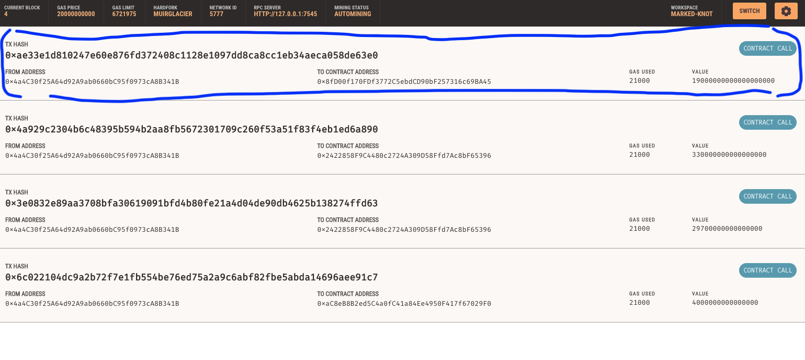
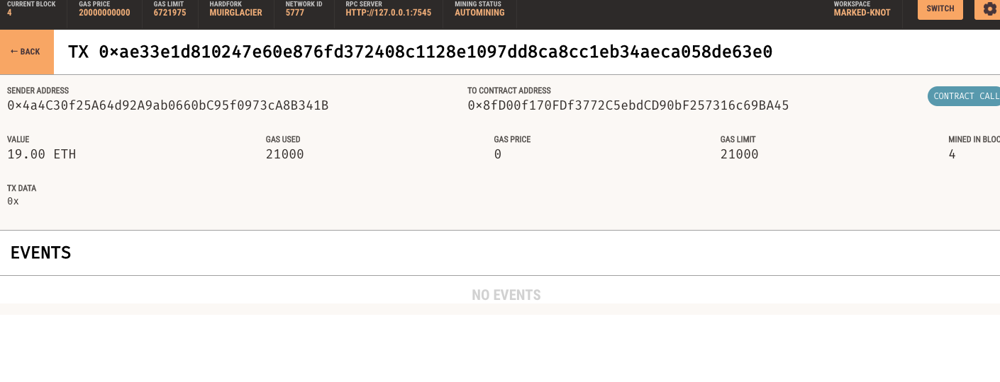
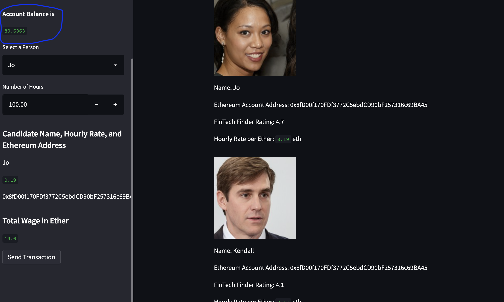

## FinTech Finder

This program enables customers to hire and pay FinTech professionals. The program integrates the Ethereum blockchain network (using Ganache), allowing the user to instantly pay a FinTech professional in Ether.

Below is a demonstration of how the application works. In this example, we have purchased 100 hours of Jo's time. Joe charges 0.19 ETH per hour. Therefore, the cost of this transaction will be 19 ETH.

Below is an image of the user interface, highlighting the current account balance of 99.6363 ETH:

Below is an image of the transaction on Ganache:

Below is an image of the transaction To address, showing Joe has received the 19 ETH:

Below is an image of the user interface, after the transaction has occured. This shows the user's balance of ETH has reduced to 80.6363:

---

© 2021 Trilogy Education Services, a 2U, Inc. brand. All Rights Reserved.
